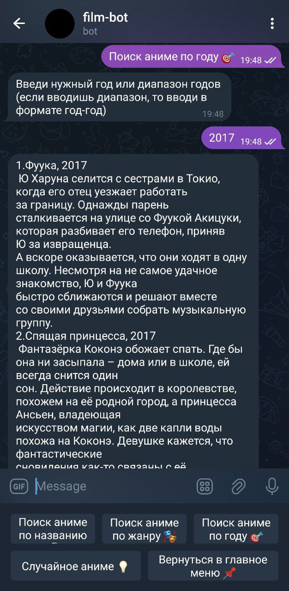
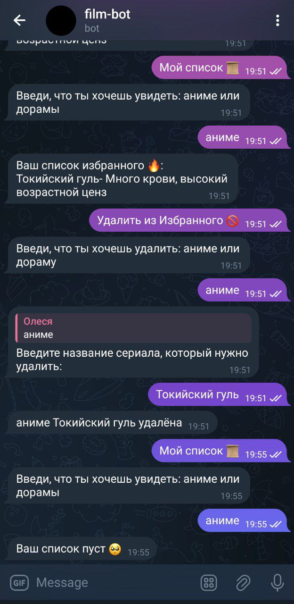

# [FILM-BOT](https://t.me/DoranimeBot)

Бот доступен в Telegram, по адресу:

https://t.me/DoranimeBot

## Функционал бота

Реализован следующий функционал:

- `/start` (начало работы: бот поприветствует вас и предложит ознакомиться с его функциями)

- `/help` (вызов справки о функциях бота: бот выдаст список всех своих функций с описаниями)

- Поиск аниме/дорам по **названию**, **жанру**, **актеру**, **году**.

- Случайное (-ая) аниме/дорама.

Также реализована возможность пользователем добавить аниме или дораму в список избранного. Список избранного можно редактировать и дополнять.

Примеры работы бота показаны на скриншотах.

| | | |
|-|-|-|
|  |  |
|  |  |
|  ||

## Запуск бота на вашем устройстве

1. Клонируем репозиторий:

```
git clone https://github.com/PeevaO/FILM-BOT
cd FILM-BOT
```

2. Устанавливаем зависимости:

<details>
<summary>
Если не установлен uv:
</summary>
Linux:

```
curl -LsSf https://astral.sh/uv/install.sh | sh
```

Windows:

```
powershell -ExecutionPolicy ByPass -c "irm https://astral.sh/uv/install.ps1 | iex"
```
</details>

Запускаем:

```
uv run -m film_bot
```

## API

Для поиска дорам и аниме использовано [неофициальное API кинопоиска](https://kinopoisk.dev/).

## Команда

- Пустовалова Софья Алексеевна

- Завьялова Полина Игоревна

- Пеева Олеся Романовна

- Крамаренко Юрий Андреевич
